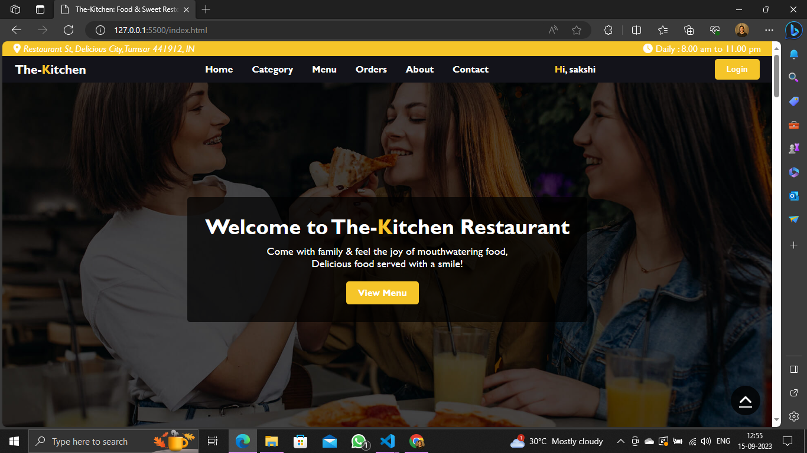
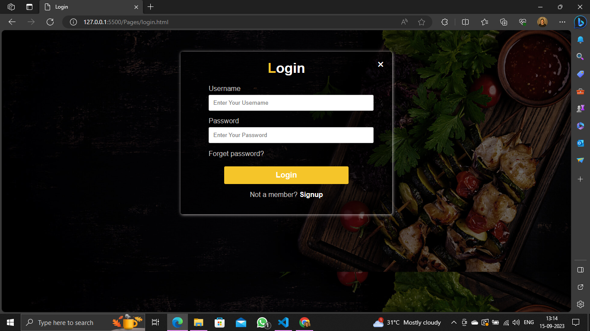
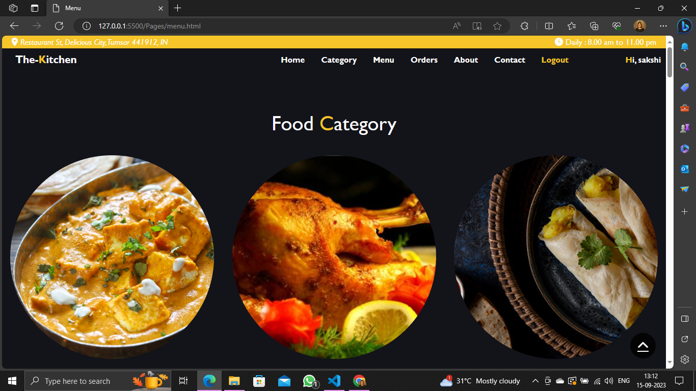
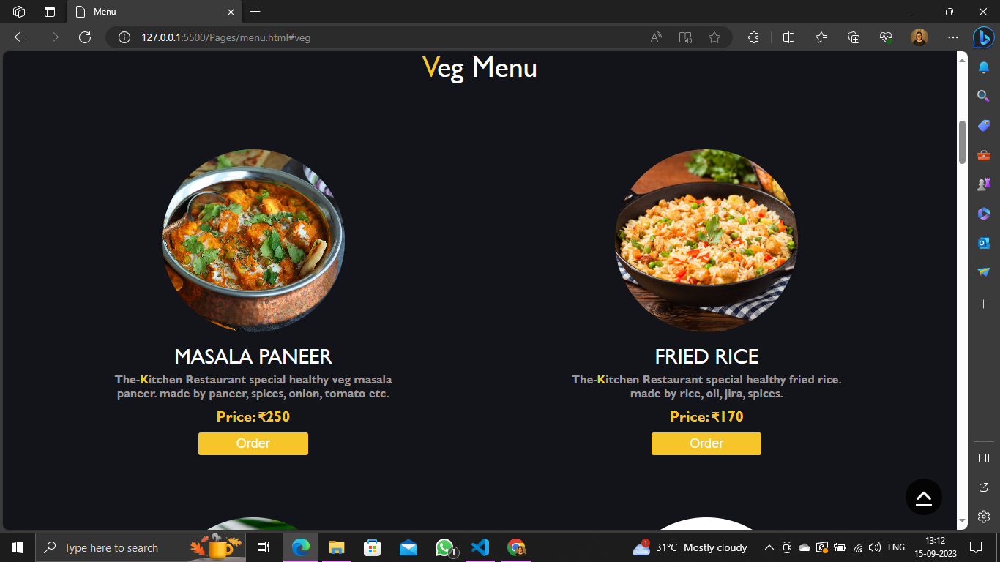
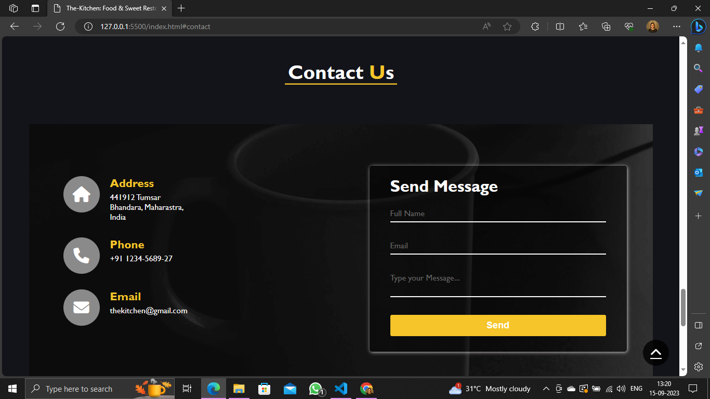

## Sakshi_Rahangdale_DOM_final_17th_Sep_23
**The-Kitchen:** This is my HTML, CSS, and JS base Project for the Restaurant  Reservation System. there are some common pages like Home, Category, Menu, About, Contact, Reservation, Login & Signup. 

## We've been making healthy food last for 5 years, We are Served healthy food since 2018.
### We have 20 Staffs, including Cooks, Manager, waiters & Cleanling Mads.
Our journey began with a simple idea: to create a place where people can savor exceptional food, unwind in a cozy ambiance, and make lasting memories with friends and family.
But it's not just about the food; it's about the experience. Our friendly and attentive staff are dedicated to making your visit exceptional.

#### Our Project live hosted link: https://eduonixjsproject.netlify.app/

### Landing Page

### Login Page

### Category Page

### Menu Page

### Reservation Page

### Reservation Page
