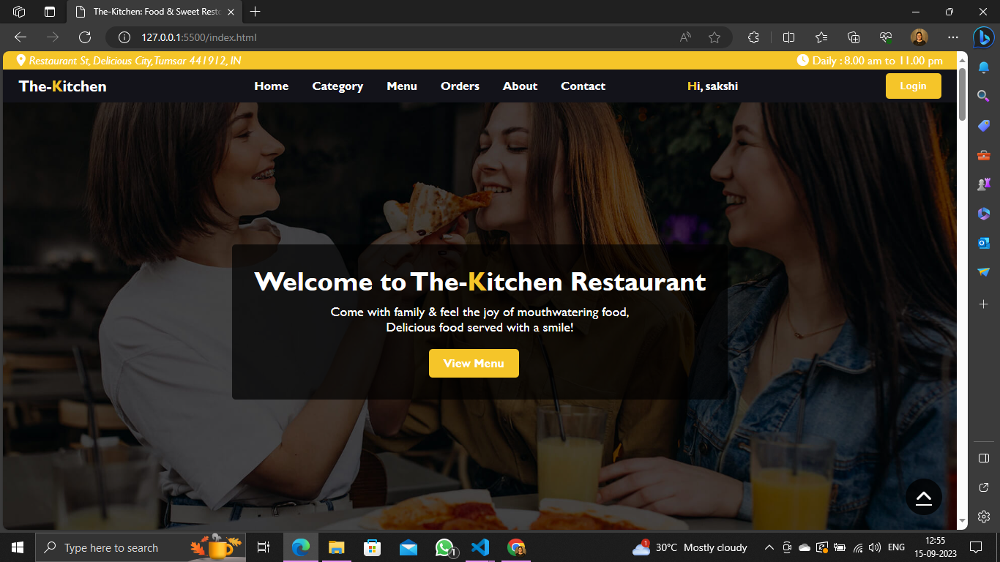
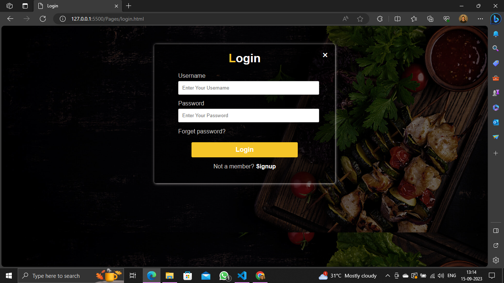
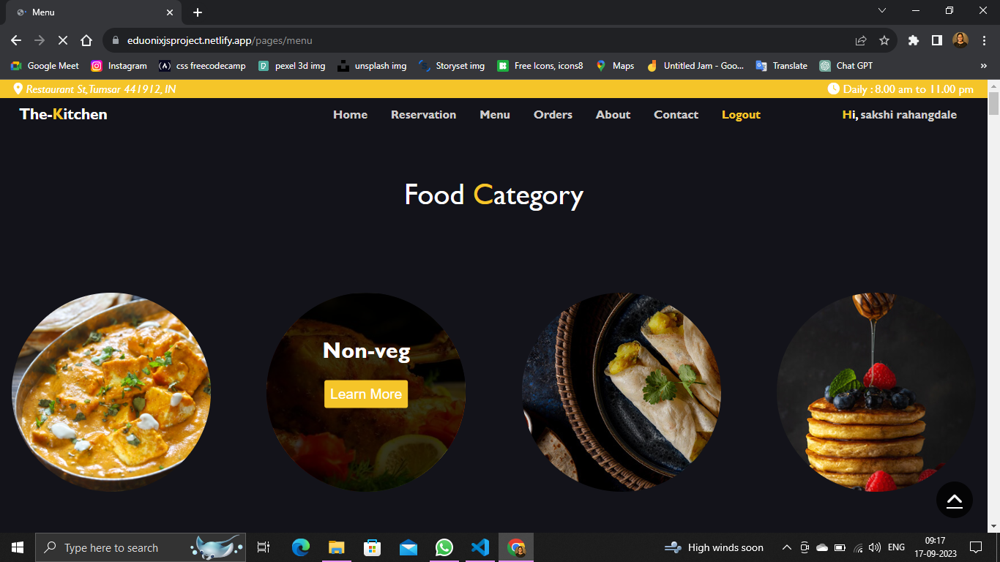
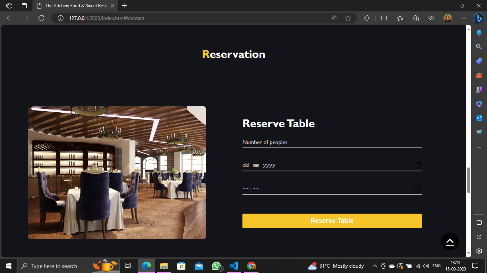
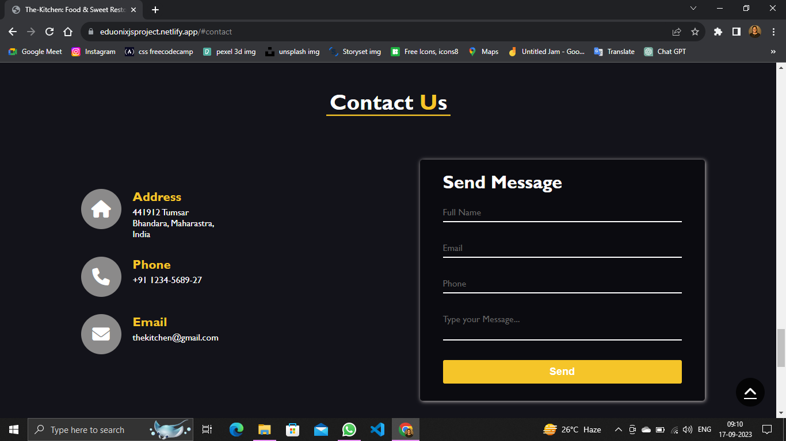

## Sakshi_Rahangdale_DOM_final_17th_Sep_23
**The-Kitchen:** This is my HTML, CSS, JS & JS-DOM base Project for the Restaurant  Reservation System. there are some common pages like Home, Category, Menu, About, Contact, Reservation, Login & Signup. 

## We've been making healthy food last for 5 years, We are Served healthy food since 2018.

Our journey began with a simple idea: to create a place where people can savor exceptional food, unwind in a cozy ambiance, and make lasting memories with friends and family.

But it's not just about the food it's about the experience. Our friendly and attentive staff are dedicated to making your visit exceptional.

#### Our Project live hosted link: https://eduonixjsproject.netlify.app/

**My thoughts about creating project:**
*When I was creating this website I learned more concepts like how to link pages, which property is suitable for any page, and especially Js-Dom concepts and I really enjoyed this project*.

## Landing Page
Welcome to The-Kitchen Restaurant, This is the our project landing page including different pages like Menu, Reservation, About, Contact, Order.

## Login Page
A login page is a fundamental component of most web applications and online services. It serves as the entry point for users to access a secure system by providing their authentication credentials.

## Category Page
Our The-Kitchen Restaurant provide differents type of category foods like Veg, Non-veg, Fast food, Desserts.

## Menu Page
This Menu page contain different delicious healthy foods in category of Veg, Non-veg, Fast food, Desserts.

## Reservation Page
Our Restaurant provides a reservation facility if you want to reserve our table or book an order, then you can do this at a suitable time or date.

## Contact Page
If you want to visit or reserve a table in our restaurant, contact us here.

